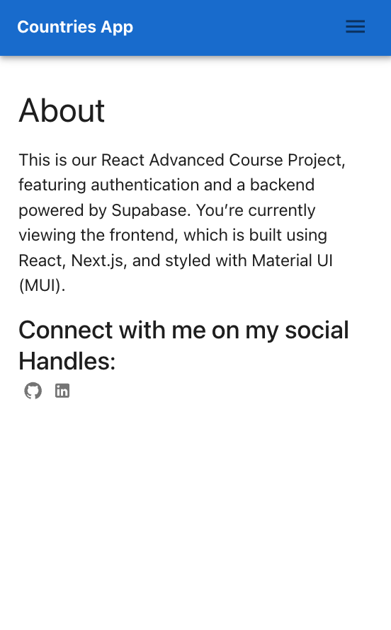

# Countries & Weather App 🌍☀️

This project was created as part of the **React Advanced Course**. It is a fully responsive web application built with **Next.js, Redux, Context API, MUI, and Supabase** for authentication.

## Features ✨

- **Authentication:** Sign up and log in using **Supabase Auth**.
- **Countries List:** Fetches data from a **Countries API**.
- **Weather Information:** Shows weather data for individual countries using a **Weather API**.
- **Favorites:** Save countries to favorites. Favorites are visible **only after logging in**.
- **Responsive Design:** Optimized for all screen sizes.
- **Navigation Drawer:** Smooth navigation between pages.

## Tech Stack 🛠️

- **Frontend:** Next.js, React
- **State Management:** Redux, Context API
- **UI Library:** MUI (Material-UI)
- **Backend/Auth:** Supabase
- **APIs:** Countries API, Weather API

## Images

## Screenshots 📸

  
  
  

Note: I will keep updating if eveything favours me
